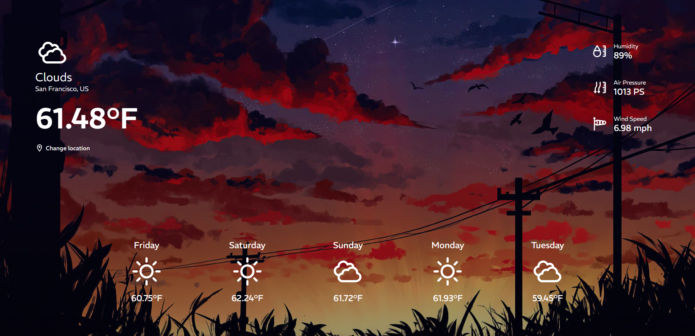

# Weather App

This weather app is a user-friendly weather app powered by the OpenWeatherMap API. It provides current weather temperatures, humidity, air pressure, wind speed, and daily forecasts. Stay informed and plan your day with my weather app!

## Built With

Vite + React + Typescript

## Getting Started

1. Get a free API Key at ```https://openweathermap.org```
2. Clone the rep
``` bash
git clone https://github.com/virel19/WeatherApp.git
```
3. Install NPM packages
``` bash
npm install
```
4. Enter your API key in `.env` (You need to create one in root directory)
``` bash
VITE_APP_KEY='ENTER YOUR API'
```

## Usage

